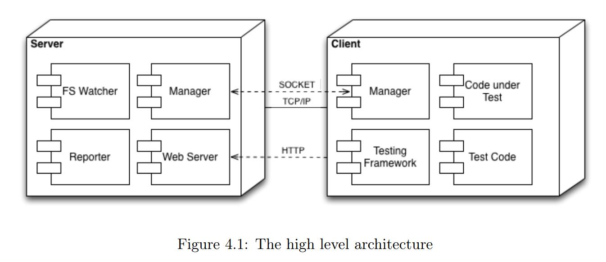

# karma

**前言:讲解 karma 的使用**

---

## karma 是什么
karma 是一个测试运行器 (test runner).
它是属于测试体系的一部分。决定了整个测试工作流。

利用 karma 实现了基于测试的代码构建流程。它具有如下特性。
1. 基于真实的浏览器，当浏览器访问 karma 测试服务时，karma 会将测试文件传给浏览器执行并在服务器端记录执行结果
2. 自动测试，karma 会在文件修改后，重新在捕获的浏览器上执行结果
3. 基于插件的生态，可选的测试框架，利用各种插件实现代码覆盖率、生成测试报告等需求
4. 调试，可以在在浏览器中直接进行对测试代码的调试


## 为什么需要 karma
在刀耕火种的年代，前端测试，我们需要在编辑器和浏览器之间进行切换。
通过反复的刷新页面或者利用控制台来查看输出结果。然而随着 node、webapp 的兴起。
前端的运行从桌面端扩展到了移动端。如何保证在多种环境下，代码的运行保持一致。
如何在复杂的前端需求中保证质量。手动测试已经变得极其昂贵和低效。
基于此 karma 将整个测试流程简化为如下过程。
1. 编写测试代码
2. 启动 karma 测试服务
3. 修改完代码后，karma 会重新运行测试
4. 开发者根据测试结果进行代码迭代

这样的基于 TDD 的工作流，使我们从繁复的手动核对中解脱出来。
将更多精力放在测试的代码的构建上，既提高了工作效能，又增强了代码的稳定性。

## karma 的工作原理
在讲解 karma 运行器时，主流的测试有如下几种。

类型|原理|特点
:---|---|---|
Mocha|基于 node 运行环境的测试运行器|不具备和浏览器的交互能力，只能单纯的测试 js|
JsTestDriver|开启测试服务,浏览器访问测试服务器，JsTD server 将测试文件传递给浏览器,并接受返回的测试结果|较理想的测试运行器
HTML Runner|类似 jasmine 或 Qunit 的测试框架，将测试文件加载到 HTML 文件中进行执行，需要手动刷新界面进行测试更新|半自动化

详细的比较参见此图

.

整个 karma 的架构如下图:



1. 服务器端
    * manager
        利用 socket.io 实现和客户端的长连接
        1. 实现对连接的管理
        2. 管理测试通讯，例如接收测试结果，发送文件变化后重载测试的命令等
    * webserver
        向客户端提供静态资源，例如测试文件，html 资源等
    * reporter
        向开发这提供测试信息，例如测试结果，客户端连接状态等
    * Fs watcher
        检测文件的变化

2. 客户端
   *  Manager
   处理底层的长连接通讯，例如向服务器告知测试结果
   * Testing Framework
   第三方测试框架，用来加载和运行测试
   * Test code
   开发这边写的测试代码，运行在测试框架中
   
根据该结构

### 运行原理
1. karma 开启了一个测试服务
2. 当浏览器访问 karma 对应的测试端口时，执行配置文件中
对应的单元测试文件。
3. 每一个浏览器将文件的执行结果返回给 karma
4. 服务器将所有文件的执行结果处理后再传递给服务器
5. karma 可根据执行结果在服务器端保存相关的日志信息

通讯模块利用 `socket.io`


## karma 快速入门
准备工作   

* 安装了 node 环境
* 安装了 git 或 github

1. 安装 karma 及相关组件

```npm
   # 安装 karma
   npm install karma --save-dev 
   
   # 安装 jasmine 测试框架
   # 安装 chrome-launcher 启动器
   npm install karma-jasmine karma-chrome-launcher --save-dev
   
   # 全局安装命令行工具
   npm install -g karma-cli
          
```

2. 配置 karma 文件   
在项目根目录下新建`karma.sysConst.js`.
文件内容如下
```js
    
```

3. 撰写测试文件
4. 运行karma


## 参考资料
* [karma 官网 ](http://karma-runner.github.io/0.10/config/configuration-file.html)
* [javascript test runner](https://dip.felk.cvut.cz/browse/pdfcache/jinavojt_2013dipl.pdf)